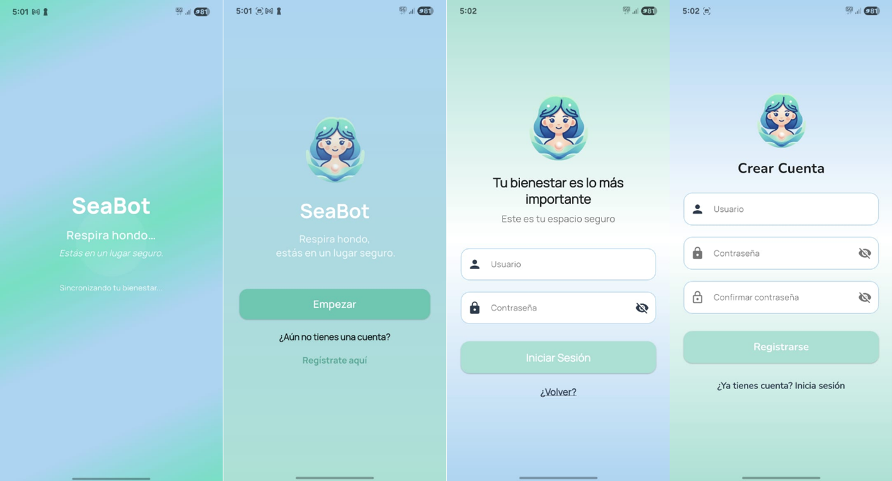
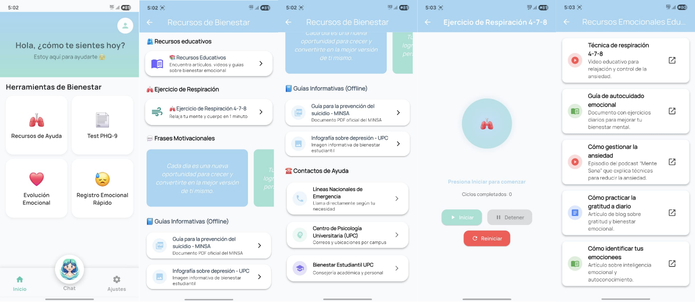
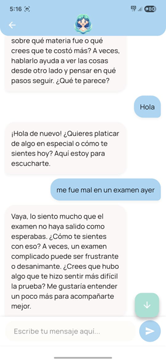
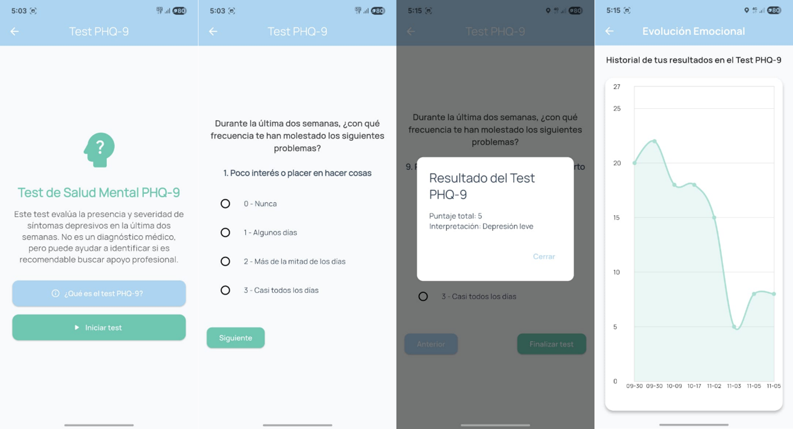
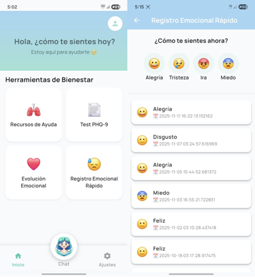
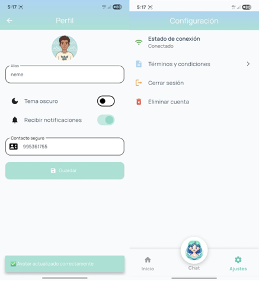
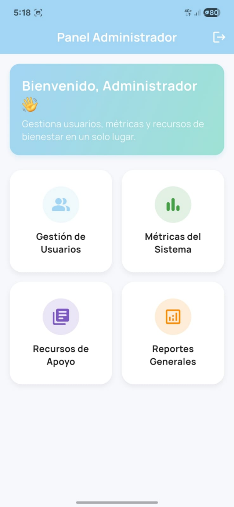
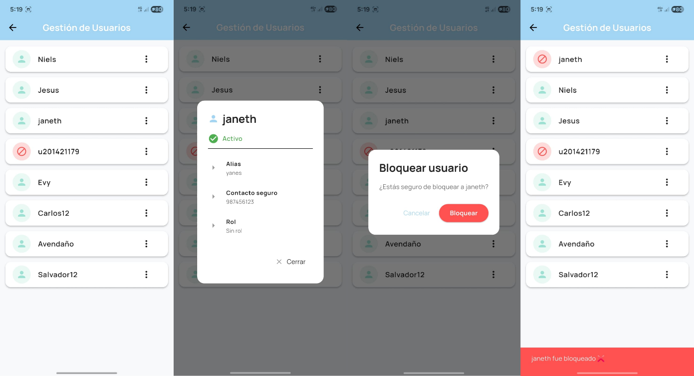
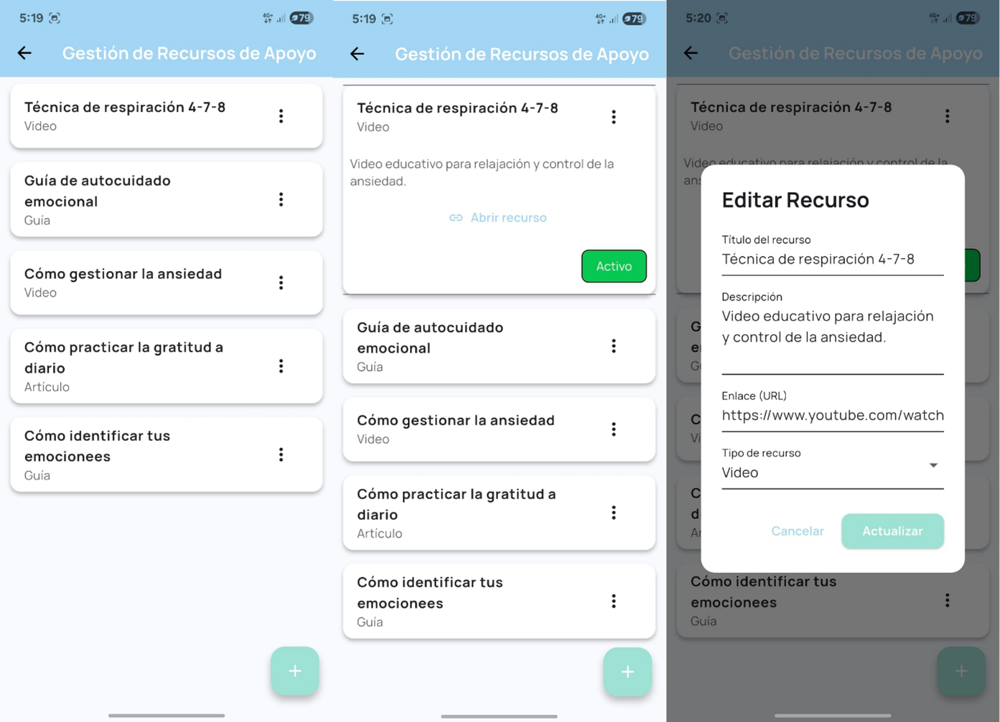
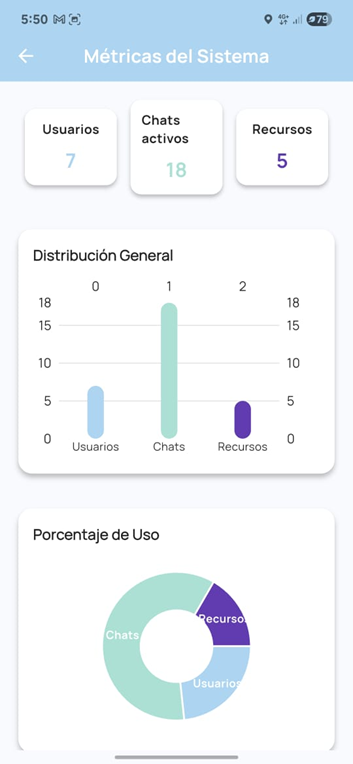

# 🧠💬 SEABOT – Chatbot de Apoyo Emocional

**SEABOT** es un chatbot inteligente orientado al **apoyo emocional y la detección temprana de riesgo suicida en jóvenes universitarios**, diseñado para brindar acompañamiento empático, monitoreo emocional y acceso a recursos de ayuda de manera inmediata.

El proyecto integra **modelos de lenguaje generativo (GPT-4)** y técnicas de **Procesamiento de Lenguaje Natural (PLN)**, y ha sido desarrollado bajo un enfoque **tecnológico, ético y académico**, como parte de un proyecto de investigación universitaria.

---

## 📂 Repositorio del backend

https://github.com/TU_USUARIO/seabot-backend

## 📂 Repositorio del frontend

https://github.com/TU_USUARIO/seabot-frontend

---

## 📝 Descripción

SEABOT es una aplicación móvil de apoyo emocional diseñada para estudiantes universitarios que presentan síntomas de estrés, ansiedad o depresión.  
A través de conversaciones empáticas en lenguaje natural, el chatbot permite al usuario expresar sus emociones, recibir orientación inicial y acceder a recursos de bienestar.

El sistema no reemplaza la atención psicológica profesional, sino que actúa como una **herramienta preventiva y complementaria**, disponible 24/7, que facilita la detección temprana de posibles riesgos emocionales y la derivación a líneas de ayuda cuando es necesario.

---

## ✅ Funcionalidades

- **Chatbot de Apoyo Emocional:**  
  Conversación empática basada en PLN y GPT-4, adaptada al contexto emocional del usuario.

- **Detección Preliminar de Riesgo Emocional:**  
  Identificación de mensajes con posibles indicadores de riesgo y activación de recursos de ayuda.

- **Test PHQ-9:**  
  Evaluación del estado emocional mediante el cuestionario PHQ-9, con registro histórico de resultados.

- **Registro Emocional Diario:**  
  Registro rápido de emociones mediante íconos y diario personal de pensamientos.

- **Gestión de Conversaciones:**  
  Creación, renombrado y valoración de sesiones conversacionales con el chatbot.

- **Recursos de Bienestar:**  
  Ejercicios de respiración, frases motivacionales y acceso a líneas de ayuda (Línea 113 / contacto seguro).

- **Panel Administrativo:**  
  Gestión de usuarios, recursos de apoyo y visualización de métricas agregadas del sistema.

---

## 💡 Tecnologías Utilizadas

- **Frontend:** Flutter
- **Backend:** Python, FastAPI
- **IA / PLN:** GPT-4 (OpenAI)
- **Base de Datos:** PostgreSQL
- **Cloud:** Google Cloud Platform (Cloud Run, Cloud SQL)
- **Herramientas:** Git, GitHub, Postman

---


## 📸 Ejecución

### Vista de usuario universitario

**Página de inicio de sesión y registro**

Pantalla inicial donde el usuario universitario puede iniciar sesión o crear una cuenta.  
El acceso se realiza mediante credenciales y se diferencia por rol (usuario o administrador).



---

**Pantalla principal y recursos de bienestar**

Vista principal de la aplicación donde el usuario accede a las funcionalidades principales:
chatbot de apoyo emocional, test PHQ-9, registro emocional, diario personal y recursos de bienestar.



---

**Interacción con el chatbot de apoyo emocional**

Pantalla de conversación donde el usuario interactúa con el chatbot basado en GPT-4.  
El sistema responde de forma empática y contextualizada, brindando acompañamiento emocional.



---

**Test PHQ-9**

Vista del cuestionario PHQ-9, utilizado para evaluar el estado emocional del usuario.
Los resultados se almacenan para el seguimiento de la evolución emocional.



---

**Registro emocional y diario personal**

Pantallas donde el usuario puede registrar sus emociones diarias mediante íconos
y escribir entradas libres en su diario personal.



---

**Gestión de conversaciones**

Vista donde el usuario puede crear, renombrar y valorar sus conversaciones
con el chatbot.


---

**Perfil del usuario**

Pantalla de configuración del perfil, donde el usuario puede modificar su alias,
avatar y contacto seguro, además de cerrar sesión o eliminar su cuenta.



---

### Vista de administrador

**Página de inicio de sesión del administrador**

Pantalla de acceso para el rol administrador, encargado de la gestión del sistema.



---

**Gestión de usuarios**

Vista administrativa donde se pueden visualizar y gestionar los usuarios registrados
en la plataforma.



---

**Gestión de recursos de apoyo**

Pantalla para la administración de recursos de bienestar, como líneas de ayuda,
ejercicios y contenido de apoyo emocional.



---

**Visualización de métricas del sistema**

Vista de métricas agregadas del sistema, que permite analizar el uso de la plataforma
y patrones generales sin comprometer la privacidad de los usuarios.




## 🔨 Instalación

### Backend

1. Clona el repositorio del backend:
```bash
git clone https://github.com/TU_USUARIO/seabot-backend.git
