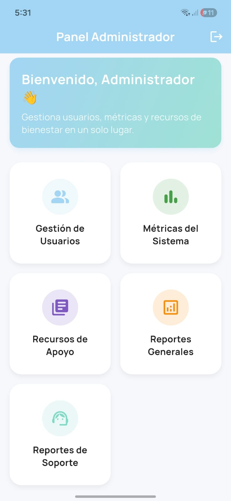

## 📸 Ejecución

A continuación, se muestran las principales vistas de la aplicación móvil SEABOT, separadas por el rol de usuario universitario y administrador.

---

## 👨‍🎓 Vista de usuario universitario

### 🔐 Inicio de sesión y registro

  

  Pantalla inicial donde el usuario universitario puede iniciar sesión o crear una cuenta.

---

### 🏠 Pantalla principal y recursos de bienestar

  

  Vista principal de la aplicación donde el usuario accede al chatbot, test PHQ-9, registro emocional, diario personal y recursos de bienestar.

---

### 💬 Interacción con el chatbot de apoyo emocional

  

  Pantalla de conversación donde el usuario interactúa con el chatbot basado en GPT-4.

---

### 🧪 Test PHQ-9

  

  Vista del cuestionario PHQ-9 utilizado para evaluar el estado emocional del usuario.

---

### 😊 Registro emocional y diario personal

  

  Pantalla donde el usuario puede registrar sus emociones diarias mediante íconos.

---

### 🗂️ Gestión de conversaciones

  

  Vista donde el usuario puede crear, renombrar y valorar sus conversaciones con el chatbot.

---

### 👤 Perfil del usuario

  

  Pantalla de configuración del perfil, donde el usuario puede modificar su alias, avatar y contacto seguro.

---

## 🛠️ Vista de administrador

### 🔐 Inicio de sesión del administrador

  

  Pantalla de acceso para el rol administrador.

---

### 👥 Gestión de usuarios

  

  Vista administrativa donde se pueden visualizar, filtrar, bloquear y desbloquear usuarios registrados.

---

### 📚 Gestión de recursos de apoyo

  

  Pantalla para administrar recursos de bienestar, líneas de ayuda, ejercicios y contenido de apoyo emocional.

---

### 📊 Visualización de métricas del sistema

  

  Vista de métricas agregadas del sistema para analizar el uso de la plataforma.

